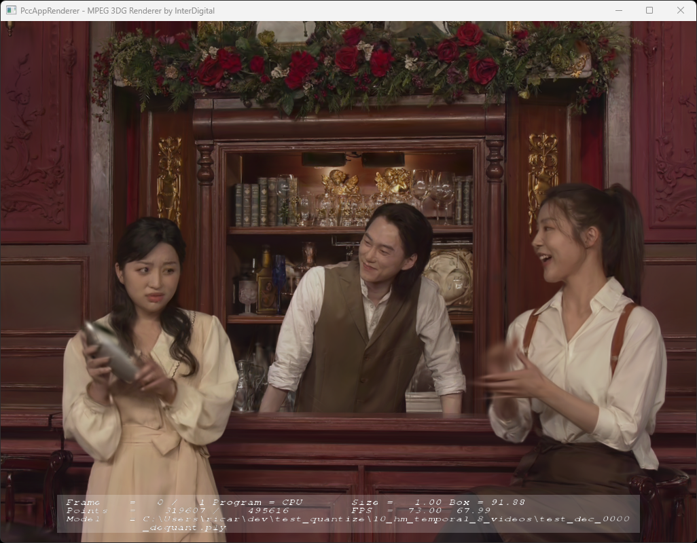

# MPEG GSC Test Model Candidate Video 

This project is a Python implementation of encoding and decoding 3DGS files into video. It provides tools for encoding and decoding 3DGS data, making it easy to use these files in your projects.

Main features: 

- Encodes 3DGS files into V3C bitstreams.
- Decodes 3DGS files from V3C bitstreams.
- Easy-to-use Python API for integration with other projects.
- Easy configuration to handle multiple video formats:
  - Packing: temporal, planar
  - Format: yuv444, yuv400
  - Organization of each 3DGS component
  - Several video codecs: HM, VTM, FFMPEG.

# Requirements

- Python 3.7 or higher
- Required libraries (install via `pip`):
  - `numpy`
  - `pandas` (if applicable)
  - `plas`
  - Any other dependencies listed in `requirements.txt`

# Installation

## Clone the repository
   ```bash
   git clone https://git.mpeg.expert/MPEG/Explorations/GSC/gsc-software/mpeg-gsc-tmcv.git
   cd mpeg-gsc-tmcv
   ```

## Install dependencies

The environment can be easily installed from the requirements.txt and environment.yml files. 


### Requirements.txt


   ```bash
   pip install torch==2.4.0 torchvision==0.19 --index-url https://download.pytorch.org/whl/cu118
   conda install -c conda-forge ffmpeg
   pip install -r requirements.txt
   ```
   
### Conda (Recommended)

  ```bash
  conda env create -f environment.yml
  conda activate v3c_gsc_video_integration_152
  ```

This will automatically install:
- PyTorch 2.4 with CUDA 11.8 support
- All required Python dependencies
- CUDA pruning utilities (compiled from `utils/pruning/`)

### PLAS

 ```bash
 pip install git+https://github.com/fraunhoferhhi/PLAS.git
```

### HM, VTM and VTM-Rext

To install the HM, VTM, and VTM with RExt__HIGH_BIT_DEPTH_SUPPORT enabled, you can use the provided script: `./scripts/install_dependencies.sh`.

This script will:
- Clone the official repositories of HM and VTM (including the VTM-Rext variant) into the ./dependencies/ directory
- Build each encoder and decoder using the appropriate toolchain (e.g., MSVC or GCC)
- Enable `RExt__HIGH_BIT_DEPTH_SUPPORT` for the VTM-Rext build
- Save the absolute paths to all encoder/decoder binaries in a JSON file located at:`./dependencies/binary_path.json`.

This JSON file can then be used by other scripts or Python tools to automatically locate the correct binaries for encoding and decoding.

### Others softwares 

To evaluate the decoded files and especially the quality, we strongly encourage you to install and use the following software: 
- [mpeg-gsc-tools](https://git.mpeg.expert/MPEG/Explorations/GSC/gsc-software/mpeg-gsc-tools) 
- [mpeg-gsc-metrics](https://git.mpeg.expert/MPEG/Explorations/GSC/gsc-software/mpeg-gsc-metrics)
- [mpeg-3d-renderer](https://git.mpeg.expert/MPEG/Explorations/GSC/gsc-software/mpeg-3d-renderer)

In particular, we encourage the use of mpeg-gsc-tools/gsTools/ to add camera positions in the source ply files to make it easier to use the renderer:

Example:

```bash
$ ./build/msvc/Release/bin/Release/cameraPosition.exe \
   --input=./bartender_stable_m71763/track/frame000.ply \
   --camera=./bartender_stable_m71763/colmap_data/frame000/sparse/cameras.txt \
   --image=./bartender_stable_m71763/colmap_data/frame000/sparse/images.txt \
   --output=frame000_pos.ply
   -v 1
```

The [update_pre_post_processing](https://git.mpeg.expert/MPEG/Explorations/GSC/gsc-software/mpeg-gsc-tools/-/tree/update_pre_post_processing?ref_type=heads) branch allows to preserve the camera position in quantized and dequantized ply files.

If camera positions are present in the PLY files, mpeg-3d-renderer can be used to evaluate the quality of the object. The 'tab' shortcut allows you to move the camera to the positions defined in the PLY files.

```bash
$ $ ../mpeg-3d-renderer/bin/windows/Release/PccAppRenderer.exe \
  -g 1  \
  -f ../test_quantize/10_hm_temporal_8_videos/test_dec_0000_dequant.ply
```



# Usage

## Encoder

```bash
$ python encode.py --help
python encode.py -h
usage: encode.py [-h] [-c CONFIG] [-i, INPUT] [-n NUM_FRAMES] [--first_frame FIRST_FRAME] [-b, BIN] [-r, REC] [--ascii] [--min_block_size MIN_BLOCK_SIZE] [--sort_params SORT_PARAMS] [--bd_0..31 BD_0..31]
                 [--qp_0..31 QP_0..31] [--format_0..31 FORMAT_0..31] [--packing_0..31 PACKING_0..31] [--quant_0..31 QUANT_0..31] [--codec_0..31 CODEC_0..31] [--config_0..31 CONFIG_0..31] [--comp_0..31 COMP_0..31] [--trans_position TRANS_POSITION] [--gsc_mode GSC_MODE]
                 [-v] [--decode_only] [--bitstream_log] [--remove]

Encode 3DGS point cloud to v3C bitstream

options:
  -h, --help            show this help message and exit

Input:
  -c CONFIG, --config CONFIG
                        Path to config file
  -i, INPUT, --input INPUT
                        Input ply path
  -n NUM_FRAMES, --num_frames NUM_FRAMES
                        Number of frames
  --first_frame FIRST_FRAME
                        Index of the first frame

Output:
  -b, BIN, --bin BIN    Output bin path
  -r, REC, --rec REC    Output ply path
  --ascii               Ascii output format

Sorting:
  --min_block_size MIN_BLOCK_SIZE
                        Minimum block size
  --sort_params SORT_PARAMS
                        sorting parameters

Videos:
  --bd_0..31 BD_0..31   Bitdepht values for nth video
  --qp_0..31 QP_0..31   QP values for nth video
  --format_0..31 FORMAT_0..31
                        Format values for nth video: yuv400, yuv420, yuv444
  --packing_0..31 PACKING_0..31
                        Packing values for nth video: planar, temporal
  --quant_0..31 QUANT_0..31
                        Quantization type for nth video: linear, gaussian
  --codec_0..31 CODEC_0..31
                        Codec ID for nth video
                          Codec ID can be:
                            - x264: ffmpeg x264
                            - x265: ffmpeg x265
                            - hm:  hm reference software
                            - vtm: VTM reference software
                            - vtr: VTM reference software with high bit depht support
  --config_0..31 CONFIG_0..31
                        Video encoder configuration files
  --comp_0..31 COMP_0..31
                        List of components for nth video (comma-separated)
                          Components can be:
                            - x,y,z: position coordinates (LSB)
                            - x_add,y_add,z_add: additional position coordinates (MSB)
                            - opacity: opacity
                            - scale_0,scale_1,scale_2: scale
                            - rot_0,rot_1,rot_2,rot_3: rotation
                            - f_dc_0,f_dc_1,f_dc_2: colors
                            - f_rest_0,f_rest_1,...,f_rest_44: spherical harmonics
                            - zero: add zero component to the video

Transform:
  --trans_position TRANS_POSITION
                        Transform position: signed log

Plot and traces:
  -v, --verbose         Verbose
  --decode_only         Decode only
  --bitstream_log       Bitstream write and read logs
  --remove              Remove previous directory

Example:
  ./encode.py -i %04d.ply -n 1 -b test.bin -r %04d_rec.ply

```

## Decoder

To decode a gsc v3c file, use:

```bash
$ python ./decode.py -h
usage: decode.py [-h] [-b, BIN] [-d, DEC] [--ascii] [--first_frame FIRST_FRAME] [-v] [--bitstream_log]

Decode 3DGS point cloud from v3C bitstream

options:
  -h, --help            show this help message and exit

Input:
  -b, BIN, --bin BIN    Input bin path

Output:
  -d, DEC, --dec DEC    Output ply path
  --ascii               Ascii output format
  --first_frame FIRST_FRAME
                        Index of the first frame

Plot and traces:
  -v, --verbose         Verbose
  --bitstream_log       Bitstream write and read logs

Example:
  ./decode.py -b file.v3c -d %04d_dec.ply
```

# Configuration files

Several configuration files are available under the ./cfg/ directory to test various encoding settings. These include configurations for different codecs such as HM, VTM, and FFMPEG, as well as different packing formats (planar and temporal), video format (YUUV400, YUV444) and 3DGS component orderings. 

For example, you will find temporal and planar configurations involving various numbers of video streams (e.g., 1, 3, 4, 7, 8, 21 videos), as well as mixed setups combining both packing methods. These files facilitate experimentation and validation of the different encoding pipelines.

The configuration files are: 
- ./cfg/hm/
  - test_444_4_videos.cfg
  - temporal_8_videos.cfg
  - temporal_7_videos.cfg
  - planar_1_video.cfg
  - mix_5_videos.cfg
  - mix_4_videos.cfg
- ./cfg/ffmpeg/ 
  - temporal_7_videos.cfg
  - temporal_21_videos.cfg 
  - planar_3_videos.cfg
  - planar_1_video.cfg
  - mix_4_videos.cfg
- ./cfg/vtm/
  - temporal_7_videos.cfg_ignore

# Example with floating point 3DGGS files

## Encode 

```bash
 python.exe encode.py  \
  -c    ./cfg/ffmpeg/temporal_7_videos.cfg \
  -i    /g/gs/mpeg_20250707/m71763_bartender_stable/track_pos/frame%03d_pos.ply \
  -b    ../test/temporal_7_videos/test.v3c \
  --rec ../test/temporal_7_videos/test_rec_%04d.ply \
  -n 2 \
  -v  
``` 

## Decode

```bash
 python.exe decode.py  \
  -b    ../test/temporal_7_videos/test.v3c \
  --dec ../test/temporal_7_videos/test_dec_%04d.ply \
  -v
``` 

## Rendering

```bash
./mpeg-3d-renderer/bin/windows/Release/PccAppRenderer.exe \
  -f ../test/temporal_7_videos/test_dec_%04d.ply  \
  -g 1 \
  -n 2
``` 

# Test scripts

For more examples, the following scripts:
- [./scripts/test_float.sh](./scripts/test_float.sh)
- [./scripts/test_quantize.sh](./scripts/test_quantize.sh)

can be reviewed and run for initial testing.

# Contributing

Contributions are welcome! Feel free to open issues or submit pull requests to improve the project.

# License

This project is licensed under the MPEG License. See the [`LICENSE`](./LICENCE) file for details.

# Contact  

For questions or support, please contact [jricard@global.tencent.com](jricard@global.tencent.com).  


